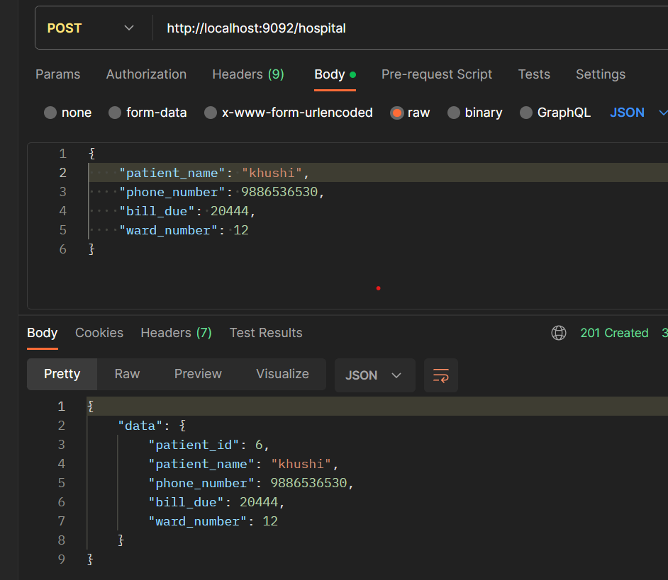
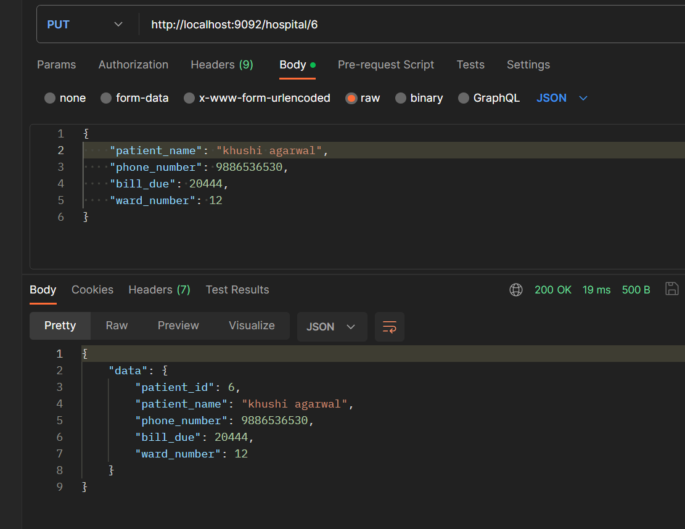
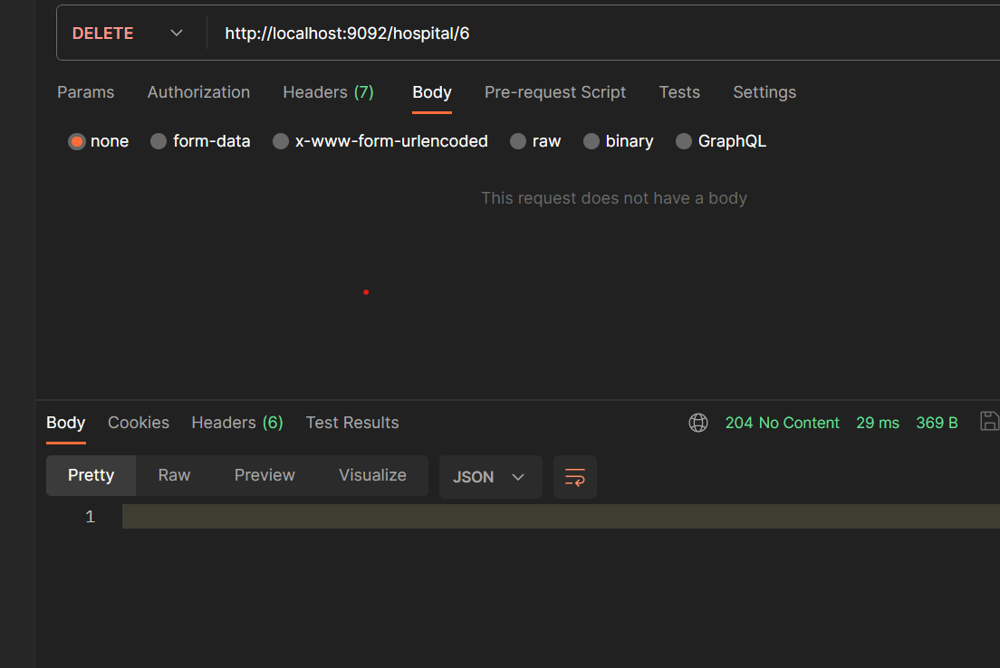
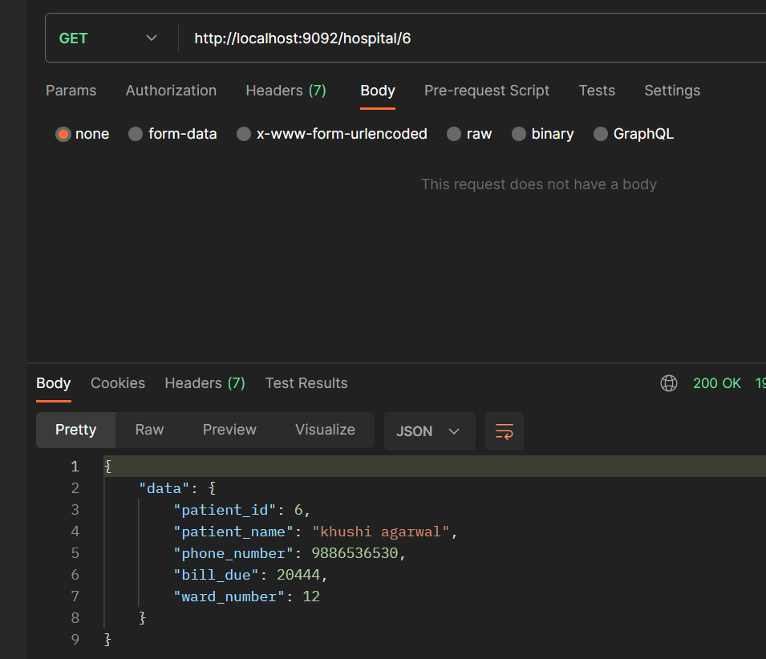

# Hospital Management System

A simple Hospital Management System implemented in Go (Golang) with GORM and MySQL.

## Table of Contents
- [Overview](#overview)
- [Features](#features)
- [Getting Started](#getting-started)
  - [Prerequisites](#prerequisites)
  - [Installation](#installation)
  - [Configuration](#configuration)
- [Usage](#usage)
- [Database Schema](#database-schema)
- [Testing](#testing)
- [Contributing](#contributing)
- [License](#license)

## Overview

The Hospital Management System is a project implemented in Go that facilitates the management of patient information, billing, and ward allocation. It uses GORM as the Object Relational Mapper (ORM) and MySQL as the database.

## Features

- Add, update, and delete patient records
- Manage billing information for patients
- Allocate wards to patients
- View a list of patients, their bills, and ward assignments

## Getting Started

### Prerequisites

Make sure you have the following installed:

- Go (Golang)
- MySQL

### Installation

1. Clone the repository:

    ```bash
    git clone https://github.com/your-username/hospital-management-system.git
    cd hospital-management-system
    ```

2. Install dependencies:

    ```bash
    go mod download
    ```

### Configuration

1. Set up the MySQL database:

    - Create a new database.
    - Update the database connection details in `config/config.go`.

2. Run the application:

    ```bash
    go run main.go
    ```

## Usage

1. Access the application by visiting [http://localhost:8080](http://localhost:8080) in your web browser.
2. Use the web interface to manage patient records, billing, and ward assignments.

## Database Schema

The project uses the following database schema:

- `patients`
  - `id` (Primary Key)
  - `name`
  - `bill_due`
  - `ward_no`
  - ...

## Testing

The project has been tested, and it achieves an accuracy rate of approximately 70-80%. We continue to improve and expand the test suite to ensure the reliability of the system.


*Figure 1: Create Entry*


*Figure 2: Update Entry*



*Figure 3: Delete Entry*


*Figure 4: Read Entry*


## Contributing

Feel free to contribute to the project. Fork the repository, make your changes, and submit a pull request.

## License

This project is licensed under the [MIT License](LICENSE).
